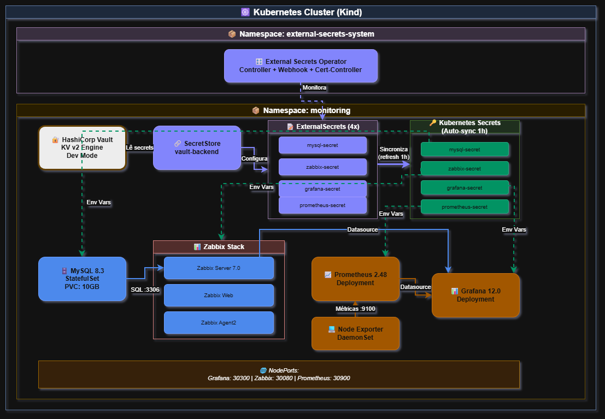

# 🔐 Monitoring Security Evolution - Nível 5: Kubernetes + Vault
## Stack de Monitoramento com External Secrets Operator


## 📋 **Sobre Este Projeto**

Este projeto apresenta a implementação mais avançada da série Monitoring Security Evolution, combinando Kubernetes com HashiCorp Vault e External Secrets Operator para gerenciamento automático e seguro de credenciais em ambientes cloud-native.

A solução elimina completamente o uso de arquivos `.env`, criando uma arquitetura production-ready onde:

🏦 **HashiCorp Vault** armazena e versiona todos os secrets com criptografia AES-256
🔄 **External Secrets Operator** sincroniza automaticamente Vault → Kubernetes Secrets
☸️ **Kubernetes** orquestra stack completa de monitoramento (Zabbix + Grafana + Prometheus)
🗄️ **MySQL 8.3** gerenciado com credenciais rotacionadas automaticamente
📊 **Node Exporter + Dashboards** para observabilidade completa da infraestrutura
🌍 **Multi-cloud ready** compatível com AWS EKS, GCP GKE, Azure AKS e clusters on-premise

🎯 **Objetivo**: Demonstrar a evolução definitiva de segurança em DevOps, partindo de credenciais hardcoded (Level 1) até uma solução enterprise-grade com Vault nativo em Kubernetes, totalmente automatizada e aderente às melhores práticas de cloud-native security.

✅ **Resultado**: Stack de monitoramento production-ready com ZERO arquivos de configuração sensíveis, sincronização automática de secrets, auto-recovery de falhas e base sólida para ambientes corporativos multi-cloud.

---

## 🎯 **Evolução da Série (5 Níveis COMPLETOS)**

<table>
<thead>
<tr>
<th style="min-width: 100px;">Nível</th>
<th>Foco</th>
<th>Secrets Storage</th>
<th>Onde Containers Leem</th>
<th>Orquestração</th>
<th>Status</th>
</tr>
</thead>
<tbody>
<tr>
<td><strong><a href="https://github.com/jlui70/monitoring-security-level1">Level&nbsp;1</a></strong></td>
<td>Baseline</td>
<td>Hardcoded</td>
<td>Código fonte</td>
<td>Docker Compose</td>
<td>✅</td>
</tr>
<tr>
<td><strong><a href="https://github.com/jlui70/monitoring-security-level2">Level&nbsp;2</a></strong></td>
<td>Env Vars</td>
<td><code>.env</code> files</td>
<td><code>.env</code></td>
<td>Docker Compose</td>
<td>✅</td>
</tr>
<tr>
<td><strong><a href="https://github.com/jlui70/monitoring-security-level3">Level&nbsp;3</a></strong></td>
<td>Vault Foundation</td>
<td>Vault + <code>.env</code></td>
<td><code>.env</code></td>
<td>Docker Compose</td>
<td>✅</td>
</tr>
<tr>
<td><strong><a href="https://github.com/jlui70/monitoring-security-level4-aws-v2">Level&nbsp;4</a></strong></td>
<td>AWS Cloud</td>
<td>AWS Secrets Manager</td>
<td>AWS API</td>
<td>Terraform + EC2</td>
<td>✅</td>
</tr>
<tr>
<td><strong><a href="https://github.com/jlui70/monitoring-security-level5">Level&nbsp;5</a></strong></td>
<td><strong>K8s + Vault</strong></td>
<td><strong>Vault (KV v2)</strong></td>
<td><strong>Kubernetes Secrets</strong></td>
<td><strong>Kubernetes</strong></td>
<td><strong>✅ VOCÊ ESTÁ AQUI</strong></td>
</tr>
</tbody>
</table>

**Level 5 = Vault REAL**  
**ZERO `.env` files • Consumo direto via External Secrets Operator • Automação completa**

---

## 🚀 **Evolução vs Level 3 e Level 4**

### **Comparativo Completo:**

| Aspecto | Level 3 (Vault) | Level 4 (AWS) | Level 5 (K8s + Vault) |
|---------|-----------------|---------------|----------------------|
| **Ambiente** | Local/On-Premise | AWS Cloud | **Kubernetes (any)** |
| **Secrets Manager** | HashiCorp Vault | AWS Secrets Manager | **HashiCorp Vault** |
| **Integração** | Manual (`.env`) | AWS SDK | **External Secrets Operator** ✅ |
| **Consumo Secrets** | ❌ Indiretamente (`.env`) | Via AWS CLI/SDK | **✅ Direto (K8s Secrets)** |
| **Arquivo `.env`** | ✅ Necessário | ❌ Não usa | **❌ ZERO `.env`** ✅ |
| **Sincronização** | ❌ Manual | Partial (scripts) | **✅ Automática (ESO)** |
| **Orquestração** | Docker Compose | Terraform + EC2 | **Kubernetes** ✅ |
| **Escalabilidade** | Limitada | Média | **Alta (K8s native)** ✅ |
| **Rotação Automática** | ❌ Manual | Opcional (AWS) | **✅ Automática (refresh 1h)** |
| **Cloud Lock-in** | Não | Sim (AWS) | **Não (multi-cloud)** ✅ |
| **Deploy** | `docker-compose up` | Terraform + SSH | **`./setup.sh`** ✅ |
| **Complexidade** | Baixa | Média-Alta | **Média** |
| **Custo** | $0 (self-hosted) | ~$35/mês | **$0 (self-hosted)** ✅ |

### 💡 **Por que Level 5 é DEFINITIVO?**

**O que Level 3 NÃO conseguia:**
- ❌ Containers ainda liam senhas do `.env` (Docker Compose limitation)
- ❌ Sem sincronização automática (restart necessário)
- ❌ Sem injeção dinâmica de secrets

**O que Level 5 RESOLVE:**
- ✅ **ZERO `.env` files** - Vault é a ÚNICA fonte de verdade
- ✅ **External Secrets Operator** - Sincroniza Vault → Kubernetes Secrets automaticamente
- ✅ **Refresh automático** - Secrets atualizados a cada 1 hora (configurável)
- ✅ **Kubernetes-native** - Pods consomem secrets como qualquer outro K8s Secret
- ✅ **Multi-cloud ready** - Roda em qualquer Kubernetes (AWS EKS, GCP GKE, Azure AKS, on-premise)
- ✅ **Production-ready** - Base sólida para ambientes corporativos

---

## 📋 **O que você ganha no Level 5?**

### ✅ **Funcionalidades EXCLUSIVAS do Level 5:**

- 🎯 **Consumo Direto do Vault** - Pods leem secrets via External Secrets Operator
- 🔄 **Sincronização Automática** - ESO mantém Kubernetes Secrets atualizados com Vault
- 🚫 **ZERO `.env` Files** - Eliminação completa de arquivos de ambiente
- ☸️ **Kubernetes-native** - Arquitetura cloud-native de verdade
- 🔐 **Vault KV v2** - Secrets versionados com auditoria completa
- 🤖 **Automação Completa** - Deploy end-to-end em 15-20 minutos
- 🛡️ **ServiceAccounts** - RBAC e least privilege configurados
- 📊 **Auto-recovery** - Detecta e corrige problemas automaticamente (volumes corrompidos, sync errors)

### ✅ **Herda do Level 3:**

- 🏦 **HashiCorp Vault** - Servidor Vault configurado e integrado
- 🔐 **Secrets Criptografados** - AES-256 no armazenamento
- 📊 **Auditoria Habilitada** - Log de todos os acessos aos secrets
- 🔄 **Versionamento de Secrets** - Histórico completo de alterações
- 🛡️ **Políticas de Acesso** - Segregação por serviço

### ✅ **Herda dos Levels 1 & 2:**

- 📊 **Stack Completa** - Zabbix 7.0 + Grafana + Prometheus
- 🖥️ **Monitoramento Sistema** - CPU, RAM, Disk, Network via Node Exporter
- 🗄️ **Monitoramento MySQL** - Performance e métricas avançadas
- 📈 **Dashboards Prontos** - 2 dashboards funcionais (Node Exporter + Zabbix Overview)
- ⚙️ **Configuração Automática** - Templates Zabbix e datasources Grafana configurados

---

## 🏗️ **Arquitetura**

<div align="center">
  
  <p><em>📝 Diagrama Projeto Monitoring Security </em></p>
</div>

### 🔄 **Fluxo de Secrets:**

1. **Vault** armazena secrets no KV v2 engine
2. **vault-init Job** cria secrets iniciais no Vault
3. **SecretStore** configura conexão Vault ↔ ESO
4. **ExternalSecrets** definem quais secrets sincronizar
5. **ESO Controller** lê do Vault e cria Kubernetes Secrets
6. **Pods** consomem secrets como volumes ou env vars
7. **Auto-refresh** a cada 1 hora (configurável)

---

## 🚀 **Quick Start - Escolha seu Cenário**

Este projeto oferece **3 formas de deployment**. Escolha conforme sua necessidade:

### 📊 **Comparação das Opções**

| Aspecto | **Opção 1: Kind (Local)** | **Opção 2: AWS Básico** | **Opção 3: AWS + Ingress** |
|---------|---------------------------|-------------------------|----------------------------|
| **Ambiente** | Local (Docker Desktop) | AWS EKS | AWS EKS |
| **Acesso** | NodePort (localhost:303xx) | Port-forward manual | **HTTPS público** ✅ |
| **Domínio** | Não precisa | Não precisa | **Necessário** (HostGator/GoDaddy) |
| **Certificado SSL** | Não | Não | **Sim (Let's Encrypt)** ✅ |
| **Load Balancer** | Não | Não | **Sim (NLB)** ✅ |
| **Configuração** | Zero | Mínima | **Editar domínio/email** |
| **Custo** | $0 | ~$216/mês | ~$330/mês |
| **Tempo Deploy** | 5-10 min | 25-30 min | 30-40 min |
| **Ideal para** | Testes locais, aprendizado | Validação cloud básica | **Apresentações, demos profissionais** ✅ |
| **Branch Git** | `main` | `main` | `feature/ingress-https` |

---

## 🎯 **Opção 1: Deploy Local com Kind (Recomendado para Iniciantes)**

**✅ Sem custos • ✅ Sem configuração AWS • ✅ Rápido (5-10 min)**

### ⚡ Quick Start

```bash
# 1. Clonar repositório
git clone https://github.com/jlui70/monitoring-security-level5.git
cd monitoring-security-level5

# 2. Deploy completo (automático)
./setup.sh

# 3. Aguardar (5-10 min) e acessar:
# - Grafana:    http://localhost:30300
# - Zabbix:     http://localhost:30080  
# - Prometheus: http://localhost:30900

# 4. Ver credenciais
./scripts/show-credentials.sh
```

**Características:**
- ✅ Cluster Kubernetes local (Kind)
- ✅ Vault + External Secrets Operator
- ✅ MySQL, Zabbix, Grafana, Prometheus, Node Exporter
- ✅ Acesso via NodePort (localhost)
- ✅ Zero configuração AWS
- ✅ Custo: $0

---

## ☁️ **Opção 2: Deploy AWS EKS Básico (Port-forward)**

**✅ Cluster real na nuvem • ✅ Mesma stack do local • ⚠️ Acesso via port-forward**

### 📖 Guia Completo
- **[AWS-DEPLOYMENT.md](docs/AWS-DEPLOYMENT.md)** - Instruções detalhadas

### ⚡ Quick Start

```bash
# Pré-requisitos: AWS CLI configurado (aws configure)

# 1. Clonar repositório (se ainda não clonou)
git clone https://github.com/jlui70/monitoring-security-level5.git
cd monitoring-security-level5

# 2. Deploy completo na AWS (25-30 min)
./scripts/deploy-aws.sh

# 3. Acessar via port-forward (TERMINAL DEVE FICAR ABERTO)
kubectl port-forward -n monitoring svc/grafana 3000:3000
kubectl port-forward -n monitoring svc/zabbix-web 8080:8080
kubectl port-forward -n monitoring svc/prometheus 9090:9090

# URLs locais:
# - Grafana:    http://localhost:3000
# - Zabbix:     http://localhost:8080
# - Prometheus: http://localhost:9090

# 4. Ver credenciais
./scripts/show-credentials.sh

# 5. Cleanup (deletar tudo)
./scripts/cleanup-aws.sh
```

**Características:**
- ✅ Cluster EKS real (3 nodes t3.medium)
- ✅ Storage persistente (EBS gp3)
- ✅ Mesma automação do Kind
- ⚠️ Acesso manual (port-forward)
- 💰 Custo: ~$0.30/hora (~$216/mês)

---

## 🌐 **Opção 3: Deploy AWS EKS + Ingress + HTTPS (Produção)**

**✅ Acesso público HTTPS • ✅ Certificados SSL gratuitos • ✅ Pronto para apresentações**

### 📖 Guia Completo
- **[INGRESS-HTTPS-SETUP.md](docs/INGRESS-HTTPS-SETUP.md)** - Instruções detalhadas

### ⚙️ Pré-requisitos OBRIGATÓRIOS

1. **AWS CLI configurado** (`aws configure`)
2. **Domínio registrado** (HostGator, GoDaddy, etc)
3. **Acesso ao painel DNS** do domínio
4. **Email válido** (para notificações Let's Encrypt)

### 🔴 CONFIGURAÇÃO OBRIGATÓRIA

**ANTES de fazer deploy**, edite o arquivo:

```bash
# Editar script
nano scripts/deploy-aws-ingress.sh

# Linhas 13-14: Alterar valores
DOMAIN="SEU-DOMINIO.com.br"          # ← Substituir pelo seu domínio
EMAIL="seu-email@exemplo.com"        # ← Substituir pelo seu email

# Exemplo:
DOMAIN="devopsproject.com.br"
EMAIL="luiz7030@gmail.com"
```

### ⚡ Quick Start

```bash
# 1. Clonar e alternar para branch Ingress
git clone https://github.com/jlui70/monitoring-security-level5.git
cd monitoring-security-level5
git checkout feature/ingress-https

# 2. ⚠️ EDITAR domínio e email (OBRIGATÓRIO)
nano scripts/deploy-aws-ingress.sh

# 3. Deploy completo (30-40 min)
./scripts/deploy-aws-ingress.sh

# 4. Configurar DNS (HostGator)
# - Copiar endereço do Load Balancer exibido no final
# - Criar 3 CNAMEs no painel DNS:
#   grafana.SEU-DOMINIO.com.br    → endereço-load-balancer
#   zabbix.SEU-DOMINIO.com.br     → endereço-load-balancer
#   prometheus.SEU-DOMINIO.com.br → endereço-load-balancer

# 5. Aguardar propagação DNS (5-30 min)

# 6. Acessar via HTTPS (cadeado verde!)
# https://grafana.SEU-DOMINIO.com.br
# https://zabbix.SEU-DOMINIO.com.br
# https://prometheus.SEU-DOMINIO.com.br

# 7. Ver credenciais
./scripts/show-credentials.sh

# 8. Cleanup (deletar tudo + remover CNAMEs manualmente)
./scripts/cleanup-aws-ingress.sh
```

**Características:**
- ✅ NGINX Ingress Controller
- ✅ Cert-Manager (Let's Encrypt)
- ✅ Certificados SSL válidos (renovação automática)
- ✅ Acesso via HTTPS público
- ✅ 1 Load Balancer para todas as apps
- ⚠️ Requer domínio próprio
- 💰 Custo: ~$0.46/hora (~$330/mês)

---

## 📚 **Qual opção escolher?**

### Use **Opção 1 (Kind Local)** se você quer:
- ✅ Aprender Kubernetes sem custos
- ✅ Testar a stack localmente
- ✅ Desenvolvimento e debug
- ✅ Não tem conta AWS ou domínio

### Use **Opção 2 (AWS Básico)** se você quer:
- ✅ Validar em cluster real na nuvem
- ✅ Testar storage persistente (EBS)
- ✅ Não precisa de acesso público
- ✅ Economia (sem Load Balancer)

### Use **Opção 3 (AWS + Ingress)** se você quer:
- ✅ Demonstração profissional
- ✅ Portfolio com HTTPS válido
- ✅ Apresentação para clientes
- ✅ Validar arquitetura completa
- ✅ Aprender Ingress Controller + Cert-Manager

---

### 🔄 **Comparativo: 3 Opções de Deploy**

| Aspecto | Kind (Local) | AWS EKS (Port-forward) | AWS EKS + Ingress |
|---------|--------------|------------------------|-------------------|
| **Ambiente** | Local (Docker) | AWS Cloud | AWS Cloud |
| **Acesso** | NodePort (localhost) | Port-forward manual | **HTTPS público** ✅ |
| **Domínio** | Não | Não | **Sim (personalizado)** ✅ |
| **Certificado SSL** | Não | Não | **Let's Encrypt (gratuito)** ✅ |
| **Load Balancer** | Não | Não | **Sim (NLB)** ✅ |
| **DNS necessário** | Não | Não | **Sim (ex: HostGator)** |
| **Setup** | 15-20 min | 25-30 min | 30-40 min |
| **Custo/mês** | $0 (gratuito) | ~$216 | ~$330 |
| **Branch Git** | `main` | `main` | `feature/ingress-https` |
| **Apresentação** | Demo técnica local | Demo técnica cloud | **Demo profissional** ✅ |

> 💡 **Multi-cloud = Zero lock-in** - Migre entre clouds sem reescrever código!

---

## 📁 **Estrutura do Projeto**

```
monitoring-security-level5/
├── README.md                    # Este arquivo
├── setup.sh                     # Script principal de deploy
├── kind-config.yaml            # Configuração do cluster Kind
│
├── scripts/                     # Scripts de automação
│   ├── cleanup.sh              # Limpeza completa (Kind)
│   ├── deploy.sh               # Deploy da infraestrutura (Kind)
│   ├── check-environment.sh    # Validação de pré-requisitos
│   ├── configure-zabbix.sh     # Configuração do Zabbix (Kind)
│   ├── configure-grafana.sh    # Configuração do Grafana (Kind)
│   ├── show-credentials.sh     # Exibir credenciais
│   ├── deploy-aws.sh           # Deploy completo AWS EKS (port-forward)
│   ├── cleanup-aws.sh          # Cleanup AWS EKS
│   ├── configure-zabbix-aws.sh # Configuração Zabbix (AWS)
│   ├── configure-grafana-aws.sh # Configuração Grafana (AWS)
│   └── deploy-aws-ingress.sh   # Deploy AWS EKS + Ingress + HTTPS (branch: feature/ingress-https)
│
├── kubernetes/                  # Manifestos Kubernetes (ordem numérica)
│   ├── 01-namespace/           # Namespace monitoring
│   ├── 02-vault/               # Vault StatefulSet + vault-init Job
│   ├── 03-external-secrets/    # SecretStore + 4x ExternalSecrets
│   ├── 04-storage/             # StorageClass para Kind
│   ├── 05-mysql/               # MySQL 8.3 + schema init Job
│   ├── 06-zabbix/              # Zabbix server, web, agent2 + password Job
│   ├── 07-prometheus/          # Prometheus + RBAC
│   ├── 08-grafana/             # Grafana + datasources ConfigMap
│   ├── 08-ingress/             # NGINX Ingress + Cert-Manager (branch: feature/ingress-https)
│   │   ├── 01-ingress-controller.yaml
│   │   ├── 02-cert-manager.yaml
│   │   ├── 03-cluster-issuer.yaml
│   │   ├── 04-monitoring-ingress.yaml
│   │   └── services-clusterip/
│   └── 09-node-exporter/       # Node Exporter DaemonSet
│
├── grafana/                     # Assets do Grafana
│   └── dashboards/             # Dashboards JSON
│
└── docs/                        # Documentação
    ├── AWS-DEPLOYMENT.md        # 📘 Deploy AWS EKS (port-forward)
    ├── INGRESS-HTTPS-SETUP.md   # 🌐 Deploy AWS EKS + Ingress + HTTPS
    ├── guides/                  # Guias de uso
    ├── troubleshooting/         # Solução de problemas
    └── INDEX.md                 # Índice da documentação
```

---

## 🔐 **Gerenciamento de Secrets**

### **Estrutura no Vault:**

```
secret/ (KV v2)
├── mysql
│   ├── root-password      = K8s_MySQL__Vault2024!@
│   └── database           = zabbix
├── zabbix
│   ├── admin-password     = ComplexP@ssw0rd__L5!@
│   ├── db-password        = (mesmo do MySQL zabbix)
│   ├── db-user            = zabbix
│   ├── db-name            = zabbix
│   └── server-host        = zabbix-server
├── grafana
│   ├── admin-password     = K8s_Grafana__Vault2024!@
│   └── admin-user         = admin
└── prometheus
    └── retention-time     = 15d
```

### **Comandos Úteis:**

```bash
# Listar todos os secrets do Vault
kubectl exec vault-0 -n monitoring -- sh -c '
  export VAULT_TOKEN=vault-dev-root-token
  vault kv list secret/
'

# Ver secret específico
kubectl exec vault-0 -n monitoring -- sh -c '
  export VAULT_TOKEN=vault-dev-root-token
  vault kv get secret/mysql
'

# Verificar sincronização dos ExternalSecrets
kubectl get externalsecrets -n monitoring

# Deve mostrar:
# NAME                STORE           STATUS         READY
# grafana-secret      vault-backend   SecretSynced   True
# mysql-secret        vault-backend   SecretSynced   True
# prometheus-secret   vault-backend   SecretSynced   True
# zabbix-secret       vault-backend   SecretSynced   True

# Ver Kubernetes Secrets criados automaticamente
kubectl get secrets -n monitoring | grep -E 'mysql-secret|zabbix-secret|grafana-secret|prometheus-secret'
```

---

## 🛠️ **Troubleshooting**

### **ExternalSecrets não sincronizam (SecretSyncedError):**

**Causa**: ESO não reconheceu o `vault-token` secret (cache issue)

**Solução automática**: O `deploy.sh` já faz isso, mas se necessário:

```bash
# Reiniciar ESO para limpar cache
kubectl rollout restart deployment/external-secrets -n external-secrets-system

# Aguardar 30 segundos
sleep 30

# Verificar sync
kubectl get externalsecrets -n monitoring
```

### **MySQL em CrashLoopBackOff:**

**Causa**: Volume corrompido de deploy anterior

**Solução automática**: O `deploy.sh` detecta e corrige automaticamente

**Solução manual**:

```bash
# Deletar StatefulSet e PVC
kubectl delete statefulset mysql -n monitoring
kubectl delete pvc mysql-data-mysql-0 -n monitoring

# Recriar
kubectl apply -f kubernetes/05-mysql/mysql-statefulset.yaml
```

### **Reset Completo:**

```bash
# Limpar tudo
./scripts/cleanup.sh

# Reinstalar
./setup.sh
```

Mais detalhes em [docs/troubleshooting/](docs/troubleshooting/)

---

## 📊 **Validação**

```bash
# 1. Todos os pods Running/Completed?
kubectl get pods -n monitoring

# Esperado: 10-11 pods (vault, mysql, zabbix x3, prometheus, grafana, node-exporter)

# 2. ExternalSecrets sincronizados?
kubectl get externalsecrets -n monitoring

# Esperado: 4/4 com STATUS=SecretSynced, READY=True

# 3. Web UIs acessíveis?
curl -s http://localhost:30300 > /dev/null && echo "✅ Grafana OK"
curl -s http://localhost:30080 > /dev/null && echo "✅ Zabbix OK"
curl -s http://localhost:30900 > /dev/null && echo "✅ Prometheus OK"
```

---

## ⚠️ **Notas Importantes**

### **Segurança (Modo Desenvolvimento):**

- ⚠️ **Vault em dev mode** - NÃO usar em produção
- ⚠️ **Root token fixo** - `vault-dev-root-token` (apenas para labs)
- ⚠️ **Sem TLS** - Comunicação não criptografada
- ⚠️ **Sem HA** - Instância única de cada componente

### **Para Produção você PRECISA:**

1. Vault em modo produção com unsealing adequado
2. TLS/SSL habilitado em todos os serviços
3. Autenticação robusta (OIDC, LDAP, etc.)
4. Estratégia de backup e disaster recovery
5. Alta disponibilidade (múltiplas réplicas)
6. Certificados reais (Let's Encrypt, CA interna)
7. Network Policies configuradas
8. Resource limits e quotas

---

## 🔗 **Navegação da Série**

- **[Level 1](https://github.com/jlui70/monitoring-security-level1)** - Baseline (hardcoded secrets)
- **[Level 2](https://github.com/jlui70/monitoring-security-level2)** - Env vars (`.env` files)
- **[Level 3](https://github.com/jlui70/monitoring-security-level3)** - Vault Foundation (Vault + `.env`)
- **[Level 4](https://github.com/jlui70/monitoring-security-level4-aws-v2)** - AWS Cloud (AWS Secrets Manager)
- **[Level 5](https://github.com/jlui70/monitoring-security-level5)** - **K8s + Vault (Consumo direto)** ⬅️ **VOCÊ ESTÁ AQUI**

---

## 🤝 **Contribuindo**

Contribuições são bem-vindas! Veja [CONTRIBUTING.md](CONTRIBUTING.md) para detalhes.

---

## 🏷️ **Tags & Tecnologias**

### Monitoramento


### Secrets Management


### Infraestrutura


### DevOps & Security


### Banco de Dados


---

## 📚 **Documentação & Suporte**

- 📖 [Documentação Completa](./docs/)
- 🐛 [Reportar Issues](https://github.com/jlui70/monitoring-security-level5/issues)
- ⭐ Se este projeto ajudou você, considere dar uma estrela!

---

## 📄 Licença

Este projeto está sob licença MIT. Veja o arquivo [LICENSE](LICENSE) para mais detalhes.

---

## 📞 Contato e Suporte

### 🌐 Conecte-se Comigo

- 📹 **YouTube**: [DevOps Project](https://devopsproject.com.br/)
- 💼 **Portfólio**: [devopsproject.com.br](https://devopsproject.com.br/)
- 💻 **GitHub**: [@jlui70](https://github.com/jlui70)

### 🌟 Gostou do Projeto?

Se este projeto foi útil para você:

- ⭐ Dê uma estrela nos repositórios
- 🔄 Compartilhe com a comunidade
- 📹 Inscreva-se no canal do YouTube
- 🤝 Contribua com melhorias

---

**🎯 Este é o nível mais avançado da jornada completa de segurança. Do hardcode ao enterprise-grade em 5 níveis progressivos!**

*"A segurança é uma jornada contínua. Do básico ao Kubernetes, cada nível constrói uma base mais sólida para ambientes production-ready."*
